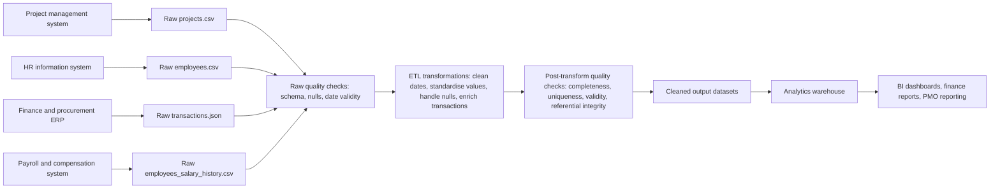

# Data Governance Document

StackUp Engineering Academy - Pillar 4 Infrastructure and Governance  
Prepared for: Presight ETL assessment  
Prepared by: Vrinda Daga  
Document date: 2026-08-24

## Scope and Assumptions

This document covers the four assessment datasets:

- `projects.csv`
- `employees.csv`
- `transactions.json`
- `employees_salary_history.csv`

Classification uses the highest applicable sensitivity. For example, salary values are both confidential business information and personal data; they are classified as `Personal (PII)` because regulatory obligations apply.

Regulatory treatment is conservative:

- UAE PDPL applies to UAE-based processing of personal data and to personal data handled by the organisation.
- GDPR applies where the dataset includes EU/EEA residents, EU/EEA employees, or processing is otherwise in GDPR scope.
- Employee PII is therefore marked `UAE PDPL + GDPR` for controls, even when the primary operating jurisdiction is the UAE.

## Section 1 - Data Inventory

| Dataset | Source system | Format | Update frequency | Volume estimate | Daily growth |
|---|---|---|---|---:|---:|
| projects | Project portfolio management system | CSV | Daily extract or on project change | 500 rows | ~0.4 project records/day based on start-date range |
| employees | HR information system | CSV | Daily HR master-data extract | 1,000 rows | ~0.1 employee records/day based on hire-date range |
| transactions | Finance/ERP and procurement system | JSON | Daily financial transaction extract | 50,000 rows | ~30 transaction records/day based on transaction-date range |
| employees_salary_history | HR compensation/payroll system | CSV | Monthly payroll cycle and ad hoc compensation changes | 1,826 rows | ~0.2 salary-change records/day based on effective-date range |

## Section 2 - Data Classification

### Classification Definitions

| Classification | Definition |
|---|---|
| Public | Non-sensitive, shareable externally |
| Internal | Internal use only, no regulatory requirement |
| Confidential | Sensitive business data requiring restricted access |
| Personal (PII) | Personal identifiable information or employment data relating to an identifiable person; regulatory requirements apply |

### Dataset: projects

| Column | Classification | Regulation for PII | Rationale |
|---|---|---|---|
| project_id | Internal | N/A | Internal project identifier |
| project_name | Internal | N/A | Internal project/program name |
| department | Internal | N/A | Organisational grouping |
| status | Internal | N/A | Project delivery state |
| start_date | Internal | N/A | Project schedule metadata |
| end_date | Internal | N/A | Project schedule metadata |
| budget | Confidential | N/A | Sensitive financial planning data |
| actual_cost | Confidential | N/A | Sensitive project spend data |
| project_manager_id | Personal (PII) | UAE PDPL + GDPR | Employee identifier linked to a named individual in the employee dataset |
| priority | Internal | N/A | Operational priority |
| region | Internal | N/A | Business operating region |

### Dataset: employees

| Column | Classification | Regulation for PII | Rationale |
|---|---|---|---|
| employee_id | Personal (PII) | UAE PDPL + GDPR | Unique employee identifier |
| full_name | Personal (PII) | UAE PDPL + GDPR | Direct personal identifier |
| email | Personal (PII) | UAE PDPL + GDPR | Direct contact identifier |
| department | Personal (PII) | UAE PDPL + GDPR | Employment attribute linked to an identifiable employee |
| role | Personal (PII) | UAE PDPL + GDPR | Employment role linked to an identifiable employee |
| level | Personal (PII) | UAE PDPL + GDPR | Employment grade linked to an identifiable employee |
| hire_date | Personal (PII) | UAE PDPL + GDPR | Employment date linked to an identifiable employee |
| salary | Personal (PII) | UAE PDPL + GDPR | Personal compensation data; also highly confidential |
| manager_id | Personal (PII) | UAE PDPL + GDPR | Employee identifier for reporting line |
| region | Personal (PII) | UAE PDPL + GDPR | Work location linked to an identifiable employee |
| status | Personal (PII) | UAE PDPL + GDPR | Employment status linked to an identifiable employee |
| years_experience | Personal (PII) | UAE PDPL + GDPR | Career attribute linked to an identifiable employee |

### Dataset: transactions

| Column | Classification | Regulation for PII | Rationale |
|---|---|---|---|
| transaction_id | Internal | N/A | Internal financial transaction identifier |
| project_id | Internal | N/A | Internal project reference |
| vendor_id | Confidential | N/A | Vendor/commercial relationship identifier |
| vendor_name | Confidential | N/A | Supplier relationship information |
| category | Internal | N/A | Spend category |
| amount | Confidential | N/A | Transaction value and financial exposure |
| currency | Internal | N/A | Currency code |
| transaction_date | Confidential | N/A | Financial transaction timing |
| approved_by | Personal (PII) | UAE PDPL + GDPR | Employee identifier for approval action |
| payment_status | Confidential | N/A | Payment and settlement status |
| invoice_ref | Confidential | N/A | Invoice reference; commercially sensitive |
| notes | Confidential | Conditional UAE PDPL + GDPR if PII appears | Free-text field can contain sensitive business context or accidental PII |

### Dataset: employees_salary_history

| Column | Classification | Regulation for PII | Rationale |
|---|---|---|---|
| employee_id | Personal (PII) | UAE PDPL + GDPR | Unique employee identifier |
| previous_salary | Personal (PII) | UAE PDPL + GDPR | Historical personal compensation |
| new_salary | Personal (PII) | UAE PDPL + GDPR | Current/new personal compensation |
| previous_role | Personal (PII) | UAE PDPL + GDPR | Historical employment attribute |
| new_role | Personal (PII) | UAE PDPL + GDPR | New employment attribute |
| previous_level | Personal (PII) | UAE PDPL + GDPR | Historical grade/level |
| new_level | Personal (PII) | UAE PDPL + GDPR | New grade/level |
| effective_date | Personal (PII) | UAE PDPL + GDPR | Date of employment compensation change |
| change_type | Personal (PII) | UAE PDPL + GDPR | Employment/payroll event type |
| change_reason | Personal (PII) | UAE PDPL + GDPR | HR decision reason; may include sensitive employment context |

## Section 3 - Data Ownership

### Owner vs Steward

The Data Owner is the accountable business role that decides why the data exists, who may access it, and what risk the organisation accepts. The Data Steward is the operational custodian who maintains definitions, quality rules, metadata, and day-to-day issue resolution. In short: the Owner is accountable for the data domain; the Steward keeps it usable, accurate, and governed.

| Dataset | Data Owner (role) | Data Steward (role) | Access approver |
|---|---|---|---|
| projects | Head of Project Management Office | PMO Data Steward | PMO Director |
| employees | HR Director | HR Operations Data Steward | HR Director or delegated HR Data Privacy Lead |
| transactions | Finance Director | Finance Operations Data Steward | Finance Director |
| employees_salary_history | HR Compensation and Benefits Lead | Payroll/Compensation Data Steward | HR Director with Finance Director approval for finance use cases |

## Section 4 - Retention Policy

| Dataset | Retention period | Justification | Disposal method | Enforcement owner |
|---|---|---|---|---|
| projects | Active project life plus 7 years after closure | Supports audits, portfolio trend analysis, contract review, and financial reconciliation where budget/actual costs affect tax and accounting records | Archive after closure; delete non-required copies after retention; anonymise `project_manager_id` in analytical history where practical | PMO Data Owner with Data Governance and Data Platform teams |
| employees | Active employment plus 7 years after termination | UAE labour-law records must be retained at least 2 years after service ends; 7 years supports payroll, audit, tax, dispute, and benefits queries | Archive inactive employees with restricted access; delete or anonymise non-required fields after retention | HR Data Owner with Records Management |
| transactions | 7 years after the relevant tax/accounting period, extended for disputes, audit holds, or investigations | Financial transactions support corporate-tax, accounting, vendor, and audit obligations; UAE FTA guidance for corporate-tax records uses at least 7 years | Immutable archive for closed periods; secure delete expired records unless legal hold applies | Finance Data Owner with Finance Controls and Data Platform teams |
| employees_salary_history | Active employment plus at least 7 years after termination, extended while disputes, pension/social-security, payroll, tax, or end-of-service claims remain possible | Salary changes are needed for payroll audit, end-of-service calculations, compensation governance, and benefits. UAE labour rules require worker files for at least 2 years after termination; UAE tax/corporate records can require longer retention. Because this file contains historical salary changes, it should follow the stricter 7-year baseline and be retained longer under legal hold if required | Encrypted archive after employee termination; anonymise for analytics; secure delete only after HR, Legal, and Finance confirm no hold remains | HR Compensation Owner with Legal, Finance, and Records Management |

## Section 5 - Access Control

Access follows least privilege. Raw PII and salary history are not provided to broad analytics users. Production access should be granted through named groups, reviewed quarterly, logged, and removed automatically when role or employment status changes.

| Persona | Projects | Employees | Transactions | Salary History |
|---|---|---|---|---|
| Data Engineer | Read + Write | Read | Read + Write | None |
| BI Analyst | Read | Read | Read | None |
| Finance Team | Read | None | Read + Write | Read |
| HR Team | None | Read + Write | None | Read + Write |
| Executive | Read | None | Read | None |

### Access Justification

- Data Engineer: needs write access to project and transaction pipeline outputs and read access to employee lookup fields for enrichment. No standing access to salary history; pipeline service accounts can be approved separately for controlled DQ jobs.
- BI Analyst: can read projects and transactions for reporting. Employee data should be restricted to approved, masked, or aggregated views; no salary history access.
- Finance Team: manages transaction controls and can read salary history only for approved payroll, budgeting, audit, or cost-accounting use cases. Finance should not update HR master data.
- HR Team: owns employee and salary-history maintenance. HR does not need direct access to transaction records for normal HR workflows.
- Executive: receives read-only project and financial summaries. No raw employee or salary-history access by default.

Salary history is restricted because it contains identifiable compensation changes. Access requires HR approval, business justification, logging, and periodic recertification. Exporting salary history outside governed storage should be blocked unless approved by HR, Legal, and Data Governance.

## Section 6 - Data Lineage

### Transformation and Quality Check Points

| Stage | Transformation or control |
|---|---|
| Source systems to raw datasets | Extracts preserve source values for traceability |
| Raw datasets to ETL | Schema validation, column presence checks, null profiling, date parsing checks |
| ETL transformations | Project status standardisation, budget variance calculation, employee data cleaning, transaction flattening, transaction enrichment with project and approver context |
| Post-transform DQ | Completeness checks, primary-key uniqueness, numeric validity, date consistency, referential-integrity checks between transactions/projects/employees |
| Warehouse/reporting | Role-based access controls, masking/aggregation for employee data, audit logging, retention enforcement |

## Minimum Controls

- Encrypt datasets at rest and in transit.
- Use role-based access groups for each dataset.
- Mask or tokenise employee identifiers in non-production environments.
- Prevent broad export of employee and salary-history data.
- Log access to PII and salary-history datasets.
- Run quarterly access reviews for PII and confidential finance data.
- Apply legal holds before deletion when disputes, audits, or investigations exist.
- Keep a data dictionary and DQ rule inventory with business owners.

## References

- UAE Government Portal: Personal Data Protection Law, Federal Decree Law No. 45 of 2021. https://u.ae/en/about-the-uae/digital-uae/data/data-protection-laws.
- European Commission: GDPR personal data definition and processing principles. https://commission.europa.eu/law/law-topic/data-protection/information-business-and-organisations/application-gdpr_en
- European Commission: GDPR principles including data minimisation, storage limitation, integrity and confidentiality, and accountability. https://commission.europa.eu/law/law-topic/data-protection/information-business-and-organisations/principles-gdpr_en
- UAE Legislation: Federal Decree Law No. 33 of 2021 on labour relations, Article 13 worker-file retention. https://uaelegislation.gov.ae/ar/legislations/1541
- UAE Federal Tax Authority: Corporate Tax FAQ record retention of at least seven years. https://tax.gov.ae/en/faq.aspx?keyword=How+long+must+I+keep+my+records+for+UAE+CT+purposes%3F
